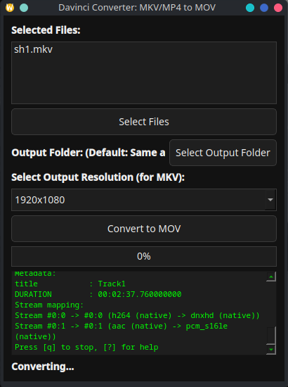
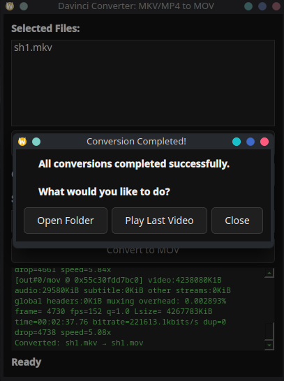

# 🎬 DaVinci Video Converter


A **lightweight video converter** built specifically for **DaVinci Resolve users on Linux**.  
DaVinci Resolve has strict codec support on Linux, and this tool converts **MKV** or **MP4** files into **MOV (DNxHD/DNxHR)**, ensuring smooth importing.

---

## ✨ Features

- ✅ **Optimized for DaVinci Resolve on Linux**  
- ✅ **Convert MKV & MP4 → MOV (DNxHD/DNxHR)**  
- ✅ **Batch conversion support**  
- ✅ **Auto-detects resolution** and warns if some files differ  
- ✅ **Mini terminal** displays FFmpeg logs live  
- ✅ **Progress bar** tracks conversion progress  
- ✅ **Delete selected files** from the list before conversion  
- ✅ **Prompt to open output folder or play video** after conversion  

---

## 🖥 Requirements

- **Linux (x86_64)**  
- **FFmpeg** installed and accessible in PATH  
- No Python installation is required when using the AppImage.

---

## 📥 Installation (AppImage)

1. **Download** the latest `.AppImage` from the [Releases page](https://github.com/LuckeeSoft/Davinci-Converter/releases).  
2. **Make it executable**:

   ```bash
   chmod +x Davinci_Converter.AppImage
3. **Run it**:

   ```bash
   chmod +x Davinci_Converter.AppImage

---

## 🖼 Screenshots

| File Selection & Conversion | Live FFmpeg Logs |
|-----------------------------|------------------|
|  |  |

---

## ✅ Known Issues

- Only **MOV output** is supported (DNxHD/DNxHR).  
- Requires FFmpeg to be installed and available in your system PATH.  
- Tested only on Linux (x86_64).

---

## 📌 Roadmap

- [ ] Add support for additional output formats (**MP4, AVI, ProRes**).  
- [ ] Custom naming templates for converted files.  
- [ ] Windows & macOS builds (planned future updates).

---

## 📝 License

This project is licensed under the **MIT License**.  
You are free to modify and redistribute it as you wish.

---

## ⭐ Support the Project

If you find this tool useful, please **star this repository** and share it with other **DaVinci Resolve users on Linux**! Your support helps keep this project alive. 😊

---

## 📫 Contact & Contributions

Feel free to open issues or submit pull requests on GitHub:  
[https://github.com/LuckeeSoft/DaVinci-Converter](https://github.com/LuckeeSoft/Davinci-Converter)

---

## 🙏 Thanks for using Davinci Converter!

---

<a href="https://app.daily.dev/luckeesoft"></a>
